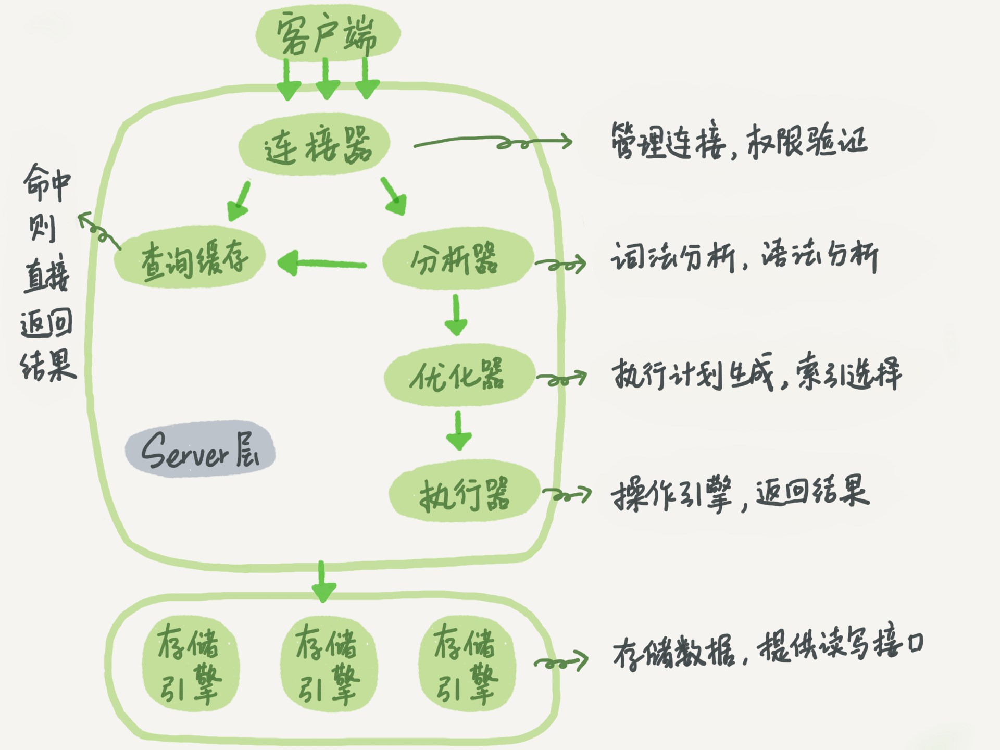

# <center>**mysql学习笔记**<center>

## **1.mysql基本架构**



1. 连接器<br>
   连接器负责跟客户端建立连接，获取权限和管理连接，命令如下:**mysql
   -h$ip -P$port -u$user -p**<br> 连接成功后，如果没有后续操作,连接处于空闲，**show
   processlist**
   可以查看，长时间没动静，连接器会自动断开。时间由参数**wait_timeout**控制得,默认8小时<br>
   长连接是指连接成功后，如果有客户端持续请求，则一直使用同一个连接。<br>
   短链接是指每次执行完很少得几次查询之后就断开连接，下次查询重新建立连接。<br>
   建立连接过程比较复杂，尽量使用长连接，但是全部用长连接，mysql占用内存会涨得比较快。
   原因:mysql执行过程中临时使用得内存是管理在连接对象里面得，资源会在断开
   连接才释放，所以，长期积累下来，导致内存占用太大，被系统杀掉，也就是mysql异常重启。
   解决方案:(1)定期断开长连接，使用一段时间或者程序里面判断执行一个占用内存得大查询后，断开连接，后面需要查询再重连
   (2)mysql5.7或更新版本,执行比较大得操作后，通过执行**mysql_reset_connection**来重新初始化连接资源。这个过程不需要重新连接和权限验证，但是会恢复到
   刚连接得状态

2. 查询缓存<br>
   mysql会到缓存中查询之前是否执行过这条语句。之前语句得执行结果会被以kv存在内存中。命中缓存直接返回，效率会很高。<br>
   但是缓存查询，弊大于利。查询缓存失效非常频繁，只要有对一个表的更新，表上所有查询缓存都会被清空。所以对于经常更新得表，
   查询命中率非常低，除非静态表，很久才更新一次，比如系统配置表，这张表上得查询才适合使用查询缓存。<br>
   可以将**query_cache_type设置成 DEMAND**，对于默认得sql都不使用缓存查询。对于需要使用得语句，用**SQL_CACHE**显示指定使用缓存。例如:**select
   SQL_CACHE * from T where
   ID=10；**注意，从8.0开始，mysql将查询缓存功能删除了。

3. 分析器<br>
   真正执行sql语句，分析器会做词法分析，分析sql语句里面得字符串分别是什么，代表什么，然后做语法分析，判断sql语句是否满足mysql语法。

4. 优化器<br>
   优化器是在表里面有多个索引得时候决定使用哪个索引，或者多表联查，决定表得访问顺序。

5. 执行器<br>
   开始执行得时候，先判断下你对这个表有没有执行查询得权限。有权限继续执行。


## **2.mysql日志模块**

1. redo log(重做日志InnoDB引擎特有的日志)<br>
   WAL技术全称是Write-Ahead Logging。先写日志再写磁盘。具体来说，有记录需要更新时，
   InnoDB引擎把记录写到redo log，更新内存，更新就算完成。同时，InnoDB引擎会在适当得时候把操作记录更新到磁盘
   ，一般是系统空闲得时候做。<br>
   有了redo log，InnoDB可以保证即使数据库发生异常重启，之前提交得记录不会丢失，称为crash-safe。<br>
   **innodb_flush_log_at_trx_commit**设置为1的时候，表示每次事务的redo log都直接持久化到磁盘，可以保证异常重启数据不丢失。

2. binlog(归档日志) <br>
   这个日志是mysql Server层自己得日志。最开始mysql没有InnoDB引擎，自带得是MyISAM引擎，
   MyISAM没有crash-safe得能力，只能用于归档。InnoDB是另外一个公司以插件形式引入mysql得。

   **sync_binlog**设置为1，每次事务的binlog都持久化到磁盘，保证异常重启binlog不丢失

3. 区别<br>
  （1）redo log 是 InnoDB 引擎特有的；binlog 是 MySQL 的
   Server 层实现的，所有引擎都可以使用。<br>
  （2）redo log是物理日志，记录的是“在某个数据页上做了什么修改”；binlog
   是逻辑日志，记录的是这个语句的原始逻辑，比如“给 ID=2 这一行的 c
   字段加 1 ”。<br>
  （3）redo log 是循环写的，空间固定会用完；binlog
   是可以追加写入的。“追加写”是指 binlog
   文件写到一定大小后会切换到下一个，并不会覆盖以前的日志。<br>

4.  update语句执行流程
    

5.  两阶段提交，为了让两份日志直接的逻辑一致。1。恢复临时库2。需要扩容的时候，也是全量备份加上binlog实现

## **3.事务**
    事务是引擎层实现的，MYSAIL引擎不支持事务。
    ACID（Atomicity、Consistency、Isolation、Durability，即原子性、一致性、隔离性、持久性）

1. 隔离性<br>
    当有多个事务同时执行，就可能出现脏读，不可重复读，幻读的问题。<br>
    隔离的越严实，效率越低。事务隔离级别包括:<br>

    (1)读未提交:一个事务没提交时，它做的变更就可以被别的事务看到<br>
    (2)读提交:一个事务提交之后，它的变更才可以被其他事务看到<br>
    (3)可重复读:一个事务执行过程中看到的数据，总是跟这个事务启动时看到的数据一致<br>
    (4)串行化:对于同一行记录，写会加写锁，读会加读锁，当读锁和写锁冲突时，
    后访问的事务必须等前一个事务执行完成，才能继续执行<br>

    配置方式是**transaction-isolation**的值设置成
    **READ-COMMITTED**，不同隔离级别都有自己的使用场景。<br>

2. 一致性<br>

3. 原子性<br>

4. 持久性<br>

5. 事务使用<br>
   尽量不要使用长事务，这些事务随时可能访问数据库的任何数据，所以事务提交之前，  
   所有可能用到的回滚记录都必须保留，导致占用存储空间。<br>
   事务启动方式:1.显示启动事务语句，begin和start
   transaction,配套的提交语句是commit， 回滚是rollback。2.set autocommit
   = 0 ，将这个线程的自动提交关掉。这个只要执行select
   语句，事务就启动了，不会主动提交。会持续存到主动执行commit或者rollback。所以最好
   set autocommit=1 显式启动事务。但是会多一次交互，可以使用**commit
   work and chain** 语法，提交并启动下一个事务<br>
   可以在information_schema 库的 innodb_trx
   这个表中查询长事务，比如下面这个语句，用于查找持续时间超过 60s 的事务
    ```
    select * from information_schema.innodb_trx where TIME_TO_SEC(timediff(now(),trx_started))>60
    ```

## **4.索引**

1. 索引出现是为了提高查询效率，实现索引的方式确有很多钟。比如哈希表，有序数组和搜索树。<br>
   哈希表是一种kv存储数据的结构，不过多个key经过哈希函数计算会出现一个值的情况，拉链法解决。但是
   哈希表这种结构只使用于等值查询的时候，如果范围查询就要全部扫描。<br>
   有序数组等值查询和范围查询性能都很优秀。但是更新数据很麻烦，往中间插入记录就要挪到后
   面所以记录，成本太高。只适用于静态存储引擎。<br>
   二叉搜索树的特点是:父节点左子树所有结点的值小于父节点的值，右子树所有结点的值大于父节点的值。
   当日为了保持这棵树是平衡二叉树，更新的时间复杂度也是LogN。树也有多叉。大多数数据库存储不使用
   二叉树，因为索引不止存在内存中，还有写到磁盘。为了让一个查询尽量少地读磁盘，就必须让查询过程
   访问尽量少的数据块。那么，我们就不应该使用二叉树，而是要使用“N叉”树。这里，“N 叉”树中的
   “N”取决于数据块的大小。<br>
   以 InnoDB的一个整数字段索引为例，这个 N 差不多是 1200。这棵树高是 4的时候，就可以存 1200 的 3 次方个值，这已经 17
   亿了。考虑到树根的数据块总是在内存中的，一 个 10亿行的表上一个整数字段的索引，查找一个值最多只需要访问 3次磁盘。
   其实，树的第二层也有很大概率在内存中，那么访问磁盘的平均次数就更少了。N叉树由于在读写上的性能优点，以及适配磁盘
   的访问模式，已经被广泛应用在数据库引擎中了。<br>
   当然随着不断迭代优化现在有跳表，LMS等数据结构。

2. InnoDB 的索引模型<br>
   表都是根据主键顺序以索引的形式存放。称为索引组织表。使用了B+树模型，所以数据都是存储在B+树种的。
   B树也称B-树,它是一颗多路平衡查找树。我们描述一颗B树时需要指定它的阶数，阶数表示了一个结点最
   多有多少个孩子结点，一般用字母m表示阶数。当m取2时，就是我们常见的二叉搜索树。B+树与B树最大
   的不同是内部结点不保存数据，只用于索引，所有数据（或者说记录）都保存在叶子结点中。<br>
   索引类型分为主键索引（聚簇索引）和非主键索引:主键索引的叶子节点存的是整行数据，非主键索引的叶子节点内容
   是主键的值，也被称为二级索引。<br>
   主键索引和普通索引的查询有什么区别？非主键索引需要回表多扫描一棵索引树。回到主键索引树搜索的过程，称为回表。<br>
   B+树为了维护索引有序性，插入新值需要进行索引维护。所以自增主键的插入数据模式都是追加操作。比较好。
   比如身份证和id哪个做主键，身份证做主键的话，每个二级索引的叶子节点占用20个字节。显然，主键长度
   越小，普通索引的叶子节点就越小，普通索引占用的空间也就越小。<br>
   当只有一个索引而且是唯一索引的时候适合用业务字段做主键，这就是典型的kv场景。

3. 覆盖索引 索引树上直接提供查询结果，不需要回表，称为覆盖索引。
   由于覆盖索引可以减少树的搜索次数，显著提升查询性能，所以使用覆盖索引是一个常用的性能优化手段。

4. 最左前缀原则。
   B+树这种索引结构，可以利用索引的“最左前缀”，来定位记录。不只是索引的全部定义，只要满足最左
   前缀，就可以利用索引来加速检索。这个最左前缀可以是联合索引的最左 N个字段，也可以是字符串索引 的最左 M 个字符。<br>
   建立索引时如何安排索引内的字段顺序。我们要考虑的是索引的复用能力。第一原则是，如果通过调整顺序，
   可以少维护一个索引，那么这个顺序往往就是需要优先考虑采用的。第二原则空间，根据字段大小。

5. 索引下推

    ```
    select * from tuser where name like '张%' and age=10 and ismale=1;
    ```

    以市民表的联合索引为例。mysql5.6之前，只能找到符合姓名的id后，一个一个回表，
    到主键索引上找出数据行，再对比字段值。5.6之后的索引下推优化，可以在索引遍历过程中，
    对索引中包含的字段先做判断，过滤掉不满足条件的记录。减少回表次数。

6. 主键索引可以多个字段，有这么一个表

    ```
    CREATE TABLE `geek` (
      `a` int(11) NOT NULL,
      `b` int(11) NOT NULL,
      `c` int(11) NOT NULL,
      `d` int(11) NOT NULL,
      PRIMARY KEY (`a`,`b`),
      KEY `c` (`c`),
      KEY `ca` (`c`,`a`),
      KEY `cb` (`c`,`b`)
    ) ENGINE=InnoDB;
    ```

    历史原因，需要a,b做联合主键。那为什么c上有索引，已经包含abc了，为什么还要建立ca，cb？

    ```
    select * from geek where c=N order by a limit 1;
    select * from geek where c=N order by b limit 1;
    ```

    为了这两个语句，就需要建立ca，cb吗？ 主键 a，b 的聚簇索引组织顺序相当于
    order by a,b ，也就是先按 a 排序，再按 b 排序，c 无序。 索引 ca
    的组织是先按 c 排序，再按 a 排序，同时记录主键 索引 cb 的组织是先按 c
    排序，在按 b 排序，同时记录主键 ca可以去掉，cb需要保留。

## **5.锁**

1.  全局锁<br>
     对整个数据库实例加锁，命令是**Flush tables with read lock
     (FTWRL)**之后其他线程的数据更新语句，数据定义语句，和更新类事务的提交语句都会被阻塞。<br>
     全局锁的典型使用场景是，做全库逻辑备份。在备份过程中整个库处于只读状态。<br>
     如果在主库上备份，备份期间都不能执行更新，业务要停。<br>
     如果在从库备份，备份期间从库不能执行主库同步过来的binlog，导致主从延迟。<br>
     但是不加锁的话因为不同表之间的执行顺序不同进而备份的时间不同。如果某个表在这个时间差
     中进行了更新并且成功被备份，而与其有关联的表已经在之前备份完毕已无法更新。此时就发生数据不一致。<br>
     官方自带的备份工具是mysqldump，当 mysqldump 使用参数–single-transaction 的时候，导数据之前就会启动一个事务，
     来确保拿到一致性视图。而由于 MVCC 的支持，这个过程中数据是可以正常更新的。前提是引擎要支持这个隔离级别。<br>
     既然要全库只读，为什么不用**set global readonly=true**的方式？<br>
     1.有些系统，readonly的值会被用来做其他逻辑，比如判断一个库是主库还是备库。<br>
     2.异常处理机制。如果执行FTWRL命令之后由于客户端发生异常断开，那么mysql会自动释放这个全局锁，整个库可以回到正常更新
     状态。而设置为readonly之后，客户端发生异常，数据库会一直保持readonly状态，会导致整个数据库长时间不可写，风险高。

2.  表级锁<br>
   （1）表锁。语法**lock tables ...read/write**,可以用unlock tables 主动释放锁，也可以再客户端断开的时候自动释放。<br>
   （2）MDL(metadata lock)访问一个表的时候自动加上。MySQL5.5版本引入，对表做增删改查的时候，加MDL读锁，对表做结构变更的
    时候，加MDL写锁。读锁之间不互斥，读写锁，写锁之间互斥。MDL锁在语句执行开始时申请，语句结束后不会马上释放，等到整个
    事务提交后释放。<br>
    如何给小表加字段?
    解决长事务，事务不提交，一直占着MDL锁。在 MySQL 的 information_schema 库的 innodb_trx 表中，你可以查到当前执行中的
    事务。如果你要做 DDL 变更的表刚好有长事务在执行，要考虑先暂停 DDL，或者 kill 掉这个长事务。如果是热点表，kill未必
    有用，比较理想的机制是，在 alter table 语句里面设定等待时间，如果在这个指定的等待时间里面能够拿到 MDL 写锁最好，
    拿不到也不要阻塞后面的业务语句，先放弃。之后开发人员或者 DBA 再通过重试命令重复这个过程。
    **ALTER TABLE tbl_name NOWAIT add column ALTER TABLE tbl_name WAIT N add column**
3.  行锁<br>
    InnoDB支持行锁,MyISAM不支持。<br>
    在 InnoDB 事务中，行锁是在需要的时候才加上的，但并不是不需要了就立刻释放，而是要等到事务结束时才释放。
    这个就是两阶段锁协议。如果你的事务中需要锁多个行，要把最可能造成锁冲突、最可能影响并发度的锁尽量往后放。<br>
    当并发系统中不同线程出现循环资源依赖，设计得线程都在等待别的线程释放资源时，会导致几个线程进入无限等待状态成为死锁。<br>
    出现死锁后，有两种策略:1.直接等待直到超时，通过参数**innodb_lock_wait_timeout**设置，但是时间值大无法接受，
    值小容易误伤。2.主动死锁检测。发现死锁后，主动回滚死锁链条中得某一个事务,主动死锁检测在发生死锁得似乎，
    可以快速发现，但是会有额外负担。<br>
    热点更新，很多线程同时更新同一行，死锁检测会发现没有所，但是会消耗大量得cpu资源。所以会看到cpu利用率很高，
    但每秒执行不了几个事务。解决方法:1.如果确保业务一定不会出现死锁，可以临时关闭死锁检测。意味着出现大量超时业务有损。
    2.控制并发度。可以做在数据库服务端中间件，也可以坐在mysql里面。基本思路就是，对于相同行的更新，
    在进入引擎之前排队。这样在 InnoDB 内部就不会有大量的死锁检测工作了。


